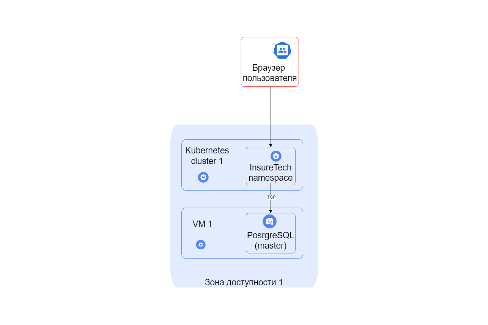
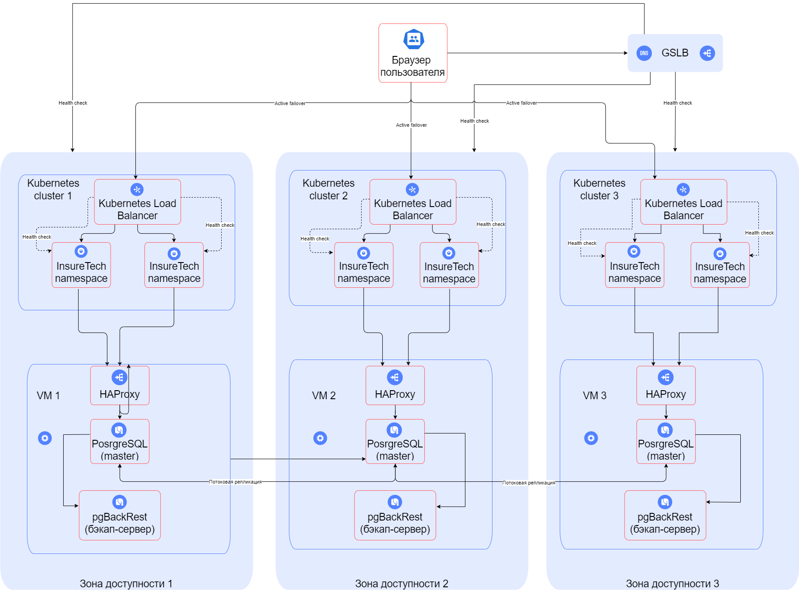

## Задание 1. Проектирование технологической архитектуры

Компания хочет сделать упор на развитие в регионах РФ. Планируется значительный рост количества пользователей и запросов. Нужно обеспечить бесперебойную работу сервиса 24/7, при этом сервис должен обслуживать клиентов из всех часовых поясов.

Требования к отказоустойчивости системы крайне высокие: RTO — 45 мин., RPO — 15 мин. Согласно требованиям бизнеса, доступность приложения должна быть равна 99,9%.

Дополнительно к этому нужно обеспечить одинаковое время загрузки страниц для пользователей из разных регионов. Оно не должно зависеть от географического местоположения пользователя.

На текущий момент сервис хранит ограниченный набор данных, который включает в себя:
- базовую информацию о клиентах — ФИО, контакты, документы,
- информацию о продуктах и тарифах,
- историю заявок клиентов.

Общий объём данных, которые хранятся в системе, равен 50 GB.

### Что нужно сделать

Необходимо спроектировать технологическую архитектуру приложения так, чтобы оно отвечало требованиям бизнеса. Создайте схему итогового решения на основании текущей технологической архитектуры сервиса.

Вот схема текущей архитектуры в draw.io:

Создайте новый документ в draw.io и назовите его «InureTech_технологическая архитектура_to-be». Работайте над первым заданием там.
Постарайтесь выдержать единый стиль оформления. Желательно, чтобы схема вашего решения была оформлена в той же нотации, что и схема текущей архитектуры. Для этого используйте библиотеки объектов Yandex Cloud. Ссылки на них мы дали в блоке «Как подготовиться к работе».

При проектировании уделите внимание следующим аспектам:
1. Определите стратегию масштабирования и отказоустойчивости. Рассмотрите вертикальное и горизонтальное масштабирование для вашей системы. Оцените, какая стратегия будет эффективнее. Требуется ли использование дополнительных зон безопасности?
2. Если приняли решение деплоить приложение в нескольких зонах безопасности, то продумайте и отразите на схеме следующие вопросы: 
    a. Проработайте конфигурацию развёртывания приложения в Kubernetes. Вы будете использовать независимые кластеры в каждой площадке или один растянутый? Оставьте на схеме комментарий с объяснением, почему вы выбрали тот или другой подход.
    b. Спланируйте балансировку нагрузки. Опишите подход к балансировке нагрузки, который обеспечит распределение трафика между вашими сервисами и географически распредёленными серверами. Явно отразите на схеме все health check.
    c. Определите наиболее подходящую фейловер-стратегию. Она должна отвечать заданным требованиям отказоустойчивости. Отразите её на схеме на уровне взаимодействия клиента с приложением.
    d. Определите конфигурацию базы данных. Учитывая требования RTO и RPO, спроектируйте конфигурацию базы данных: определите, как вы будете обеспечивать репликацию данных и их резервное копирование. Если будете использовать конкретный фреймворк конфигурации кластера БД, отразите его на схеме.
3. Определите, будете ли вы применять шардирование БД. Отразите своё решение на схеме.

## Решение

1. Стратегия масштабирования и отказоустойчивости.
    - Используем горизонтальное масштабирование главных узлов системы. Вертикальное масштабирование применять не нужно по следующим причинам:
        - по исходным данных сервис не производит сложных расчетов;
        - также до роста количества пользователей сервис справлялся с нагрузкой.
    - Используем геомасштабирование, т.к. необходима поддержка клиентов из разных часовых поясов России.
    - Система уже развернута через Kubernates, поэтому в качестве стратегий масштабирования можно использовать HPA.

2. Использование нескольких зон безопасности.

    a. Конфигурация развёртывания приложения в Kubernetes.
    - Используем независимые кластеры в разных зонах доступности. Узлы системы должны быть stateless.
    - Используем геомасштабирование, т.к. необходимо обслуживать клиентов в разных часовых поясах. 

    b. Балансировка нагрузки.
    - Используем GSLB (Global Server Load Balancer) балансировщик нагрузки, который будет развернут как минимум в 2х узлах. GSLB способен направлять трафик между несколькими центрами обработки данных.

    с. Фейловер-стратегия.
    - Так как необходимо достигнуть высоких показателей отказоустойчивости системы (доступность должна быть >= 99,9), воспользуемся фейловер-стратегией Active-Active. То есть приложение будет развернуто на нескольких серверах, которые будут одновременно обрабатывать запросы, распределяя нагрузку между собой.

    d. Конфигурация базы данных.
    - Компания уже использует PostgreSQL, поэтому лучшим решением будет использование Patroni — это шаблон конфигурации, который позволяет добиться высокой доступности и отказоустойчивости распределённого кластера PostgreSQL.

3. Определите, будете ли вы применять шардирование БД.
    - Можно обойтись без шардирования, т.к. объем данных пока небольшой.
    - В будущем можно вернуться к шардированию, например, если количество пользователей системы превысит N (100 или 500) тыс пользователей.

## Новая схема архитектуры

[Cхема в draw.io](./schema.drawio)

