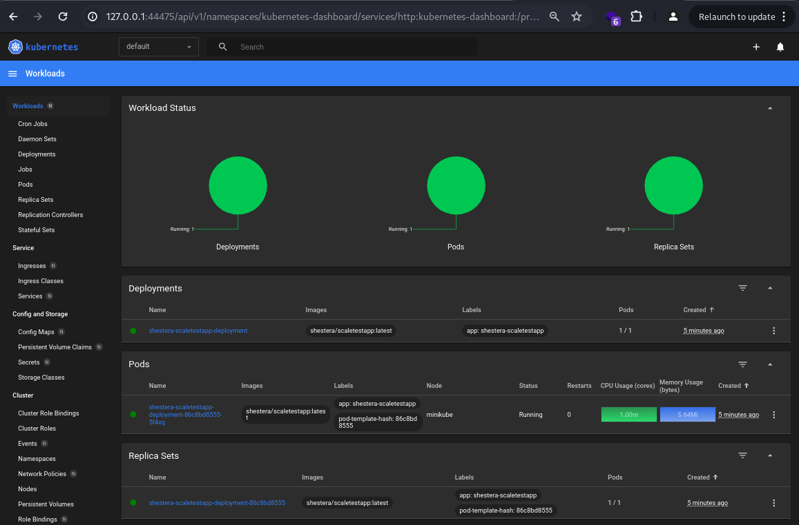
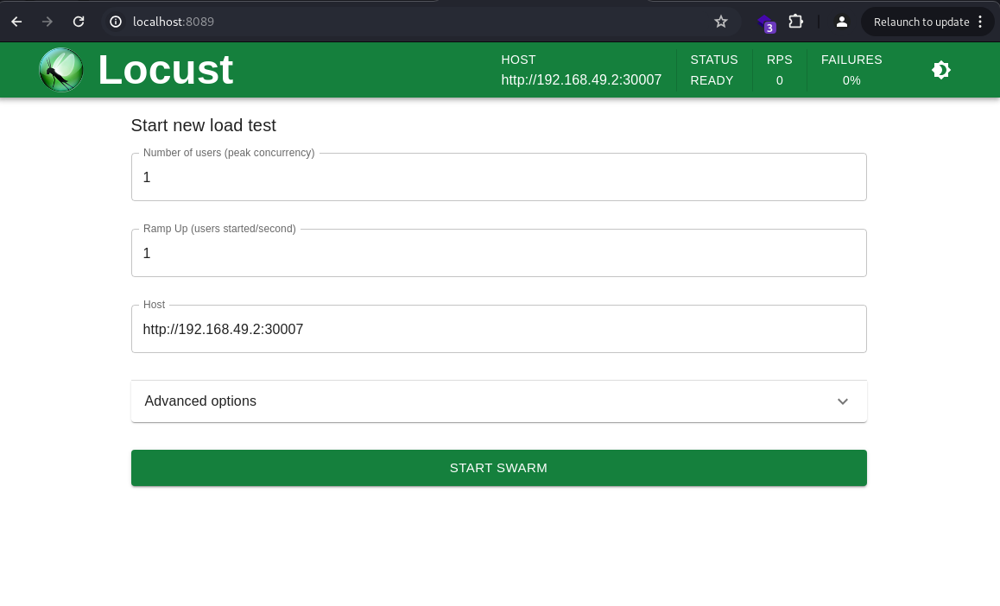

## Задание 2. Динамическое масштабирование контейнеров

Сейчас сервисы InsureTech развёрнуты в Kubernetes. Каждый из них развёрнут в определённом количестве экземпляров.

Обычно этих экземпляров достаточно для успешной обработки всех запросов. Но в периоды пиковой нагрузки система не справляется: она демонстрирует нестабильное поведение и постоянно перезагружает поды из-за нехватки памяти. Как следствие, пользователи получают негативный опыт работы с приложением. Бизнес видит, что NPS снижается.

Можно, конечно, держать больше реплик постоянно активными, чтобы система могла справиться с пиковыми нагрузками. Но это экономически невыгодно и приведёт к низким показателям утилизации ресурсов. Таким образом, вам необходимо решить проблему с помощью конфигурации динамического масштабирования для сервисов компании.

Вы будете тестировать динамическое масштабирование на примере простого приложения. Оно предоставляет два ресурса:
- GET / — получение идентификатора пода;
- GET /metrics — получение метрик в формате Prometheus.

Метрика http_requests_total возвращает количество запросов для метода получения идентификатора пода.

## Что нужно сделать

Динамическая маршрутизация на основании показателей утилизации памяти.

1. Поднимите локальный кластер Kubernetes в Minikube.
2. Активируйте metrics-server.
3. Напишите манифест развёртывания (Deployment) Kubernetes для запуска тестового приложения. Для начального количества реплик установите значение, равное единице. Лимит памяти установите равный “30Mi”. Примените написанную конфигурацию в вашем кластере.
4. Напишите и примените манифест сервиса (Service) для доступа к приложению, которое вы установили на прошлом шаге. 
5. Настройте динамическую маршрутизацию на основании показателей утилизации оперативной памяти с помощью Horizontal Pod Autoscaler (HPA). Для нашего тестового приложения оптимальный уровень утилизации памяти равен 80%. В качестве максимального количества реплик рекомендуем установить 10. Примените манифест в вашем кластере.

```bash
minikube service <имя сервиса> --url
```

6. Настройте динамическую маршрутизацию на основании показателей утилизации оперативной памяти с помощью Horizontal Pod Autoscaler (HPA). Для этого нужно активировать поддержку метрик в вашем кластере. Самый простой способ это сделать — воспользоваться командой:

```bash
minikube addons enable metrics-server
```

7. Теперь создайте манифест для Horizontal Pod Autoscaler. Этот манифест будет автоматически масштабировать количество реплик вашего приложения в зависимости от роста потребления оперативной памяти (memory). Для нашего тестового приложения оптимальный уровень утилизации памяти равен 80%. В качестве максимального количества реплик рекомендуем установить 10. Примените манифест в вашем кластере. 

8. Теперь надо убедиться, что всё работает как задумано. Для этого необходимо сгенерировать нагрузку на приложение. Воспользуйтесь инструментом нагрузочного тестирования locust:
a. Создайте Locustfile. Это сценарий на Python, где вы определяете поведение пользователей. Создайте файл с именем locustfile.py в удобной для вас директории. Скопируйте туда код:

```bash
     from locust import HttpUser, between, task
 
     class WebsiteUser(HttpUser):
         wait_time = between(1, 5)
   
         @task
         def index(self):
             self.client.get("/")
```

Этот пример создаёт класс пользователя, который переходит на главную страницу ("/") с интервалом между запросами от 1 до 5 секунд.
b. Откройте терминал и перейдите в директорию, где находится ваш locustfile.py. Выполните команду:
```bash
locust
```

c. После запуска Locust откройте веб-браузер и введите адрес http://localhost:8089. Вы увидите веб-интерфейс Locust, где можно настроить параметры теста: количество пользователей и hatch rate — скорость, с которой генерируются новые пользователи.
d. Запустите тест и проанализируйте результаты. Проще всего посмотреть результаты в дашборде Kubernetes. В локальном кластере Minikube его можно открыть с помощью команды:
```bash
minikube dashboard
```

## Решение

1. Запускаем minikube и активируем виджет metrics-server.
    

2. Разворачиваем манифесты deployment, service и hpa.
    - [deployment](./deployment.yaml)
    - [service](./service.yaml)
    - [hpa](./hpa.yaml)

    ```bash
    $ kubectl apply -f deployment.yaml
    deployment.apps/shestera-scaletestapp-deployment created

    kubectl apply -f service.yaml
    minikube service shestera-scaletestapp-service --url 
    curl http://192.168.49.2:30007
    Идентификатор пода: shestera-scaletestapp-deployment-86c8bd8555-5f4xq

    kubectl apply -f hpa-shestera-scaletestapp.yaml
    horizontalpodautoscaler.autoscaling/shestera-scaletestapp-hpa created
    ```

    

3. Запускаем дашборд и смотрим текущую нагрузку и количество узлов.
    

4. Запускаем Locust - инструмент для нагрузочного тестирования. Создаем нагрузку, 1000 пользователей.
    - 
    - 
    - 

5. Мониторим нагрузку в дашборде и видим, что количество подов увеличилось после старта нагрузки.
    - 
    - 
    - 
