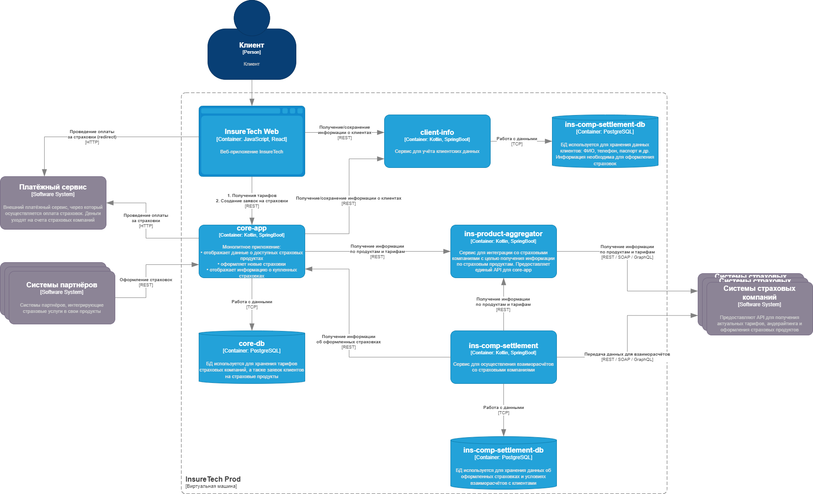
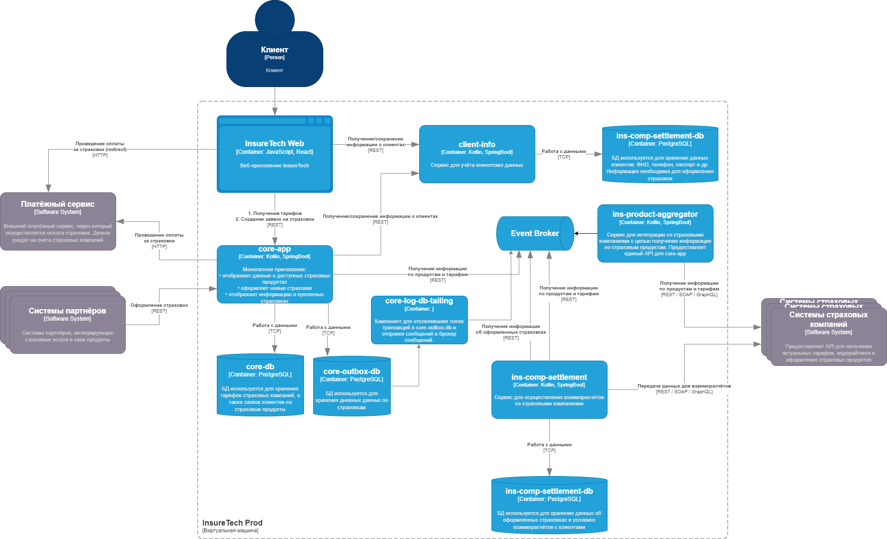

## Задание 3. Переход на Event-Driven архитектуру

Сервисы core-app и ins-comp-settlement получают данные о доступных продуктах через REST API сервиса ins-product-aggregator. В момент вызова он:
- запрашивает информацию из всех страховых компаний (сейчас их пять),
- агрегирует её в единый список,
- возвращает этот список в рамках того же синхронного запроса.

Чтобы ускорить работу сервисов, при изначальном проектировании команда решила хранить локальные реплики данных о продуктах и тарифах в сервисах core-app и ins-comp-settlement.

Сервис core-app осуществляет запрос к ins-product-aggregator раз в 15 минут, а ins-comp-settlement — раз в сутки (ночью), при формировании реестра оформленных страховок. Иногда команда сталкивается с ошибками взаимодействия между этими сервисами. Они связаны с задержками ответов или ошибками при взаимодействии с API страховых компаний.

Дополнительно сервис ins-comp-settlement раз в сутки осуществляет запрос в core-app по REST API для получения всех оформленных за день страховок. Эти данные он использует. 

В ближайшее время InsureTech планирует подписать агентское соглашение ещё с пятью страховыми компаниями. Вам предстоит спроектировать решение, которое устранит текущие проблемы.

### Что нужно сделать

1. Проанализируйте текущую архитектуру. Создайте текстовый документ и напишите там список проблем и рисков, которые связаны с планируемым ростом нагрузки. Когда всё будет готово, загрузите документ в директорию Exc3 в рамках пул-реквеста.

2. Обновите диаграмму контейнеров InsureTech, предложив решения для выявленных вами рисков и проблем. При этом:
    - Не меняя декомпозицию функциональности между сервисами, подумайте, какие взаимодействия стоит переделать на Event-Streaming.
    - Решите, будете ли вы использовать паттерн Transactional Outbox.

Когда схема будет готова, загрузите её в директорию Exc3 в рамках пул-реквеста.

#### Текущая диаграмма контейнеров InsureTech

## Решение

1. Проблемы и риски текущей архитектуры.

    - Все сервисы общаются друг с другом синхронно, что ухудшает отказоустойчивость всей системы.

    - Сервис core-app - монолитный сервис, который выполняет все ключевые функции приложения. Сервис реализован на единственном сервере, что также ухудшает отказоустойчивость всей системы.

    - С ростом количества сторонних сервисов кратно вырастет нагрузка на все 3 сервиса, что скажется на доступности всей системы. Также увеличится количество ошибок.

2. Возможное решение

    Чтобы повысить отказоустойчивость, нужно перейти к событийной модели, где сервисы будут общаться асинхронно.

    - ins-product-aggregator каждые 15 минут будет вызывать сторонние API, а результаты будет отправлять в брокер сообщений, например Kafka. Остальные сервисы смогут подписаться на событие добавление новых данных и в асинхронном режиме обновлять свои локальные реплики.

    - Общение сервисов ins-comp-settlement и core-app можно реализовать с помощью все того же брокера сообщений и паттерна Transaction log tailing. Сервис core-app будет отправлять данные по страховкам за день в свою outbox таблицу, а специальный компонент будет отслеживать логи этой таблицы. При добавлении новых данных в таблицу, этот компонент отправит событие в брокер сообщений. Тогда ins-comp-settlement в асинхронном режиме обработает новые данные, подписавшись на это событие.

 ## Новая диаграмма контейнеров InsureTech
 
 [Новая диаграмма контейнеров InsureTech в draw.io](./exc3-schema.drawio)
 
 
