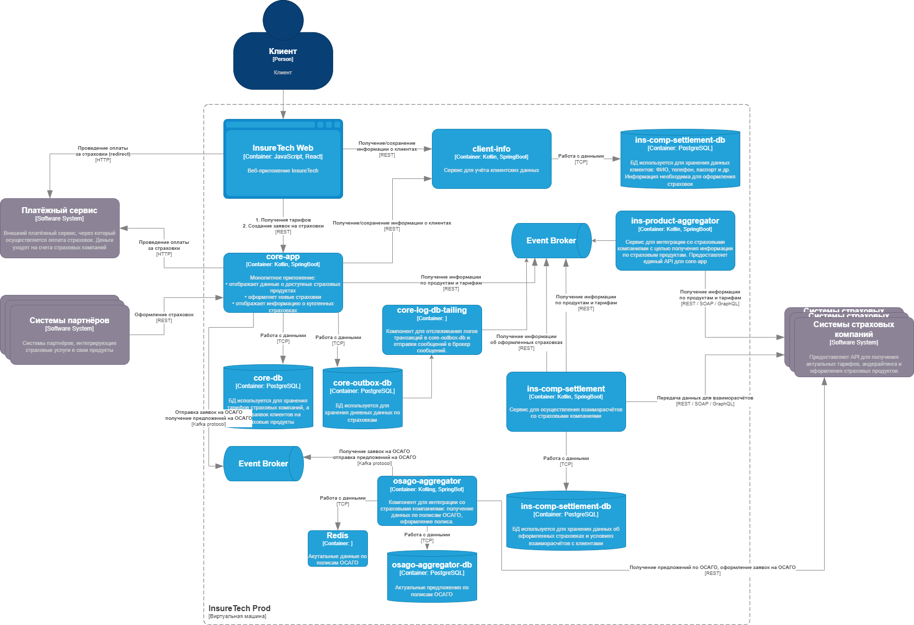

## Задание 4. Проектирование продажи ОСАГО

Компания планирует вскоре запустить новый продукт: оформление ОСАГО онлайн. Пользовательский путь выглядит так: клиенту предлагается заполнить заявку с информацией о своём автомобиле, после этого сервис запрашивает у всех доступных страховых компаний предложения с условиями страхования под заявку клиента. Бизнесу важно, чтобы на экране пользователя предложения от каждой страховой компании отображались сразу, как только от неё пришёл ответ. Максимальное время ожидания решения от страховой компании — 60 секунд. 

Все страховые компании предоставляют однотипные REST API с двумя эндпоинтами:
- создать заявку на ОСАГО,
- получить предложение по заявке.

Бизнес предполагает, что в пик нагрузки количество одновременных пользователей, создающих заявку на ОСАГО, может достигать 2,5 тысячи человек.

Вы обсудили задачу с командой разработки и приняли такие решения:
1. Сохранить подход, который использовался для получения данных о продуктах и тарифах из страховых компаний.
2. Выделить отдельный сервис для взаимодействия со страховыми компаниями — osago-aggregator.

Функциональная обязанность этого сервиса — отправка заявок в страховые компании и дальнейший опрос решений по ним для передачи результатов в core-app. Остальная функциональность, связанная с оформлением ОСАГО, остаётся на стороне бэкенда в core-app.

### Что нужно сделать

Теперь вам нужно проработать ещё несколько моментов, исходя из требований бизнеса. Доработайте схему, которая у вас получилась в третьем задании. Отразите на ней ваши решения по этим вопросам:
1. Проработайте реализацию osago-aggregator. Решите:
2. Требуется ли ему своё хранилище данных?
3. Какой API он предоставляет core-app?
4. Определите средство интеграции между сервисами core-app и osago-aggregator.
5. Подумайте над API для веб-приложения в core-app.
6. Определите средство интеграции между веб-приложением и core-app. Если будете использовать средство, отличное от REST, отразите интеграцию новой стрелкой.
7. В зависимости от выбранных средств интеграции подумайте, требуется ли где-то применение паттернов отказоустойчивости:
    - Rate Limiting,
    - Circuit Breaker,
    - Retry,
    - Timeout.
Отобразите применение паттернов на схеме с помощью обозначений из этой библиотеки.
8. Примите во внимание, что сервисы задеплоены в нескольких экземплярах. Подумайте, зависит ли ваше решение от этого.

## Решение

### Бизнес-задача

Предоставить удобный агрегатор полисов ОСАГО для клиента. Основные условия полиса ОСАГО зависят от нескольких главных параметров:
- Водитель: возраст и стаж, безаварийный стаж.
- Автомобиль: марка, мощность двигателя.
- Локация: город, регион.

Как правило, условия по полисам ОСАГО у страховых компаний не меняются чаще чем 2 раза в год.

Учитывая эти факторы, компания может заранее подготовить данные, т.е. сформировать базу данных с предложениями по страховкам ОСАГО для наиболее популярных запросов: 
- средний возраст водителей и их стаж.
- самые массовые марки автомобилей.
- города и регионы клиентов компании.

### Архитектура решения

1. Реализация osago-aggregator и средство интеграции между сервисами.
    - Сервисы core-app и osago-aggregator будут общаться через брокер сообщений, т.к. требуется немедленная отрисовка данных по мере их поступления. Таким образом core-app будет подписан на событие добавления новых данных по страховке, а сервис osago-aggregator будет отправлять это событие по мере поступления данных от разных источников. В качестве брокера сообщений можно использовать Kafka.
    - Функционал по оформлению страховки ОСАГО, можно через Long Pooling, например, запрашивать статус оформления каждые 5-10 секунд. Максимальное время ожидания будет 60 секунд. Здесь мы полагаемся на API сторонних сервисов.

2. Хранилище данных.
    - Создаем отдельную БД для нового сервиса osago-aggregator. Там будем хранить актуальные предложения по страховкам ОСАГО от компаний партнеров.
    - С некоторой периодичностью (1 раз в 3, 6 месяцев) обновлять нашу БД с актуальными предложениями по страховкам для наиболее популярных целевых запросов.

3. Кэширование.
    - Используем кэширование, например Redis, для увеличения скорости обработки запросов.

4. Паттерны отказоустойчивости.
    - Для контроля над количеством запросов к сервису osago-aggregator, используем паттерн Rate limiting, например, лимитируем количество запросов от одного пользователя.
    - Запросы, по которым не нашлось данных в нашей БД, запрашиваем напрямую через сторонние API. Есть требование по максимальной задержки в 60 секунд, поэтому можно использовать паттерн Resilient Fetch с таймаутом, т.е. паттерн будет пробовать получить данные по заданному адресу, если запрос не удался, паттерн может повторить запрос. Можно настроить задержку для последующих вызовов, а также фейловер стратегию, например, использовать второй адрес, если такой есть.

5. Возможные проблемы.
    - Так как сервис будет использовать несколько инстансов, то возможна проблема дублирования записей в БД. То есть разные инстансы могут обработать одинаковый запрос и записать его в БД. Можно периодически запускать скрипт для оптимизации записей в БД.

### Новая диаграмма контейнеров InsureTech
 
[Новая диаграмма контейнеров InsureTech в draw.io](./exc4-schema.drawio)
 

